---
## Front matter
lang: ru-RU
title: Лабораторная работа №1
subtitle: Дисциплина - основы информационной безопасности
author:
  - Пронякова О.М.
institute:
  - Российский университет дружбы народов, Москва, Россия
date: 16 февраля 2024

## i18n babel
babel-lang: russian
babel-otherlangs: english

## Formatting pdf
toc: false
toc-title: Содержание
slide_level: 2
aspectratio: 169
section-titles: true
theme: metropolis
header-includes:
 - \metroset{progressbar=frametitle,sectionpage=progressbar,numbering=fraction}
 - '\makeatletter'
 - '\beamer@ignorenonframefalse'
 - '\makeatother'
---

# Информация

## Докладчик

:::::::::::::: {.columns align=center}
::: {.column width="70%"}

  * Пронякова Ольга Максимовна
  * студент НКАбд-02-22
  * факультет физико-математических и естественных наук
  * Российский университет дружбы народов

:::
::::::::::::::

# Создание презентации

## Цель работы

- Целью данной работы является приобретение практических навыков установки операционной системы на виртуальную машину, настройки минимально необходимых для дальнейшей работы серви

## Этапы выполнения работы

Создаем новую виртуальную машину. Для этого в VirtualBox выбераем Машина -> Создать. Указываем имя виртуальной машины (мой логин в дисплейном классе), тип
операционной системы — Linux, RedHat (64-bit)(рис.1).

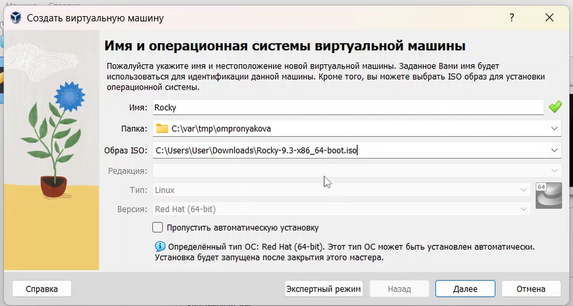{ #fig:pic1 width=100% }

## Этапы выполнения работы

Указываем размер основной памяти виртуальной машины — 2048МБ. Задаем конфигурацию жёсткого диска — загрузочный, VDI (BirtualBox Disk Image), динамический виртуальный диск. Задаем размер диска — 40 ГБ. Выбераем в VirtualBox для нашей виртуальной машины Настройки -> Носители Добавьте новый привод оптических дисков и выберите образ
операционной системы(рис.2).

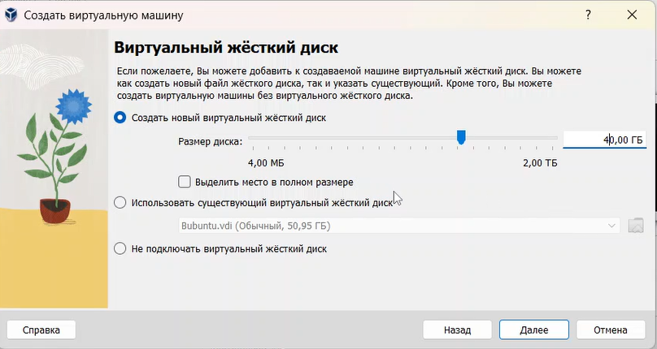{ #fig:pic2 width=100% }

## Этапы выполнения работы

Запускаем виртуальную машину и выбераем English в качестве языка интерфейса. Переходим к настройкам установки операционной системы(рис.3).

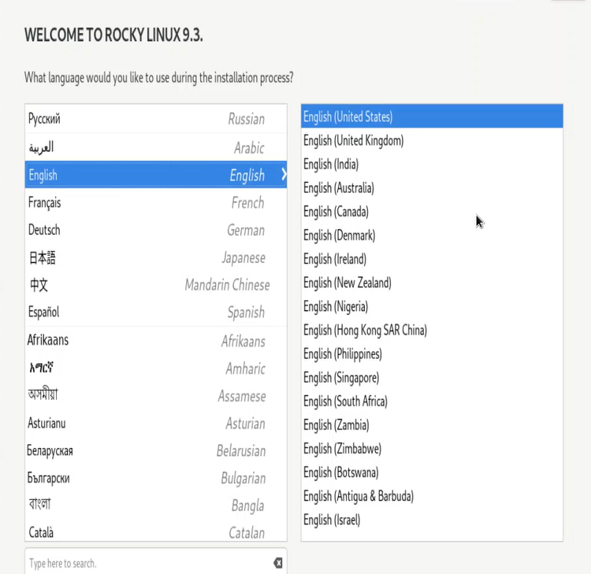{ #fig:pic3 width=100% }

## Этапы выполнения работы

В разделе выбора программ указываем в качестве базового окружения Server with GUI, а в качестве дополнения — Development Tools. Отключаем KDUMP. Место установки ОС оставляем без изменения(рис.4).

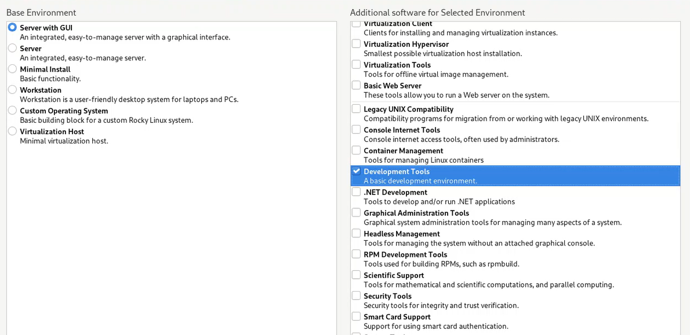{ #fig:pic4 width=100% }

## Этапы выполнения работы

Включаем сетевое соединение и в качестве имени узла указываем user.localdomain, где вместо user указываем имя своего пользователя в соответствии с соглашением об именовании(рис.5).

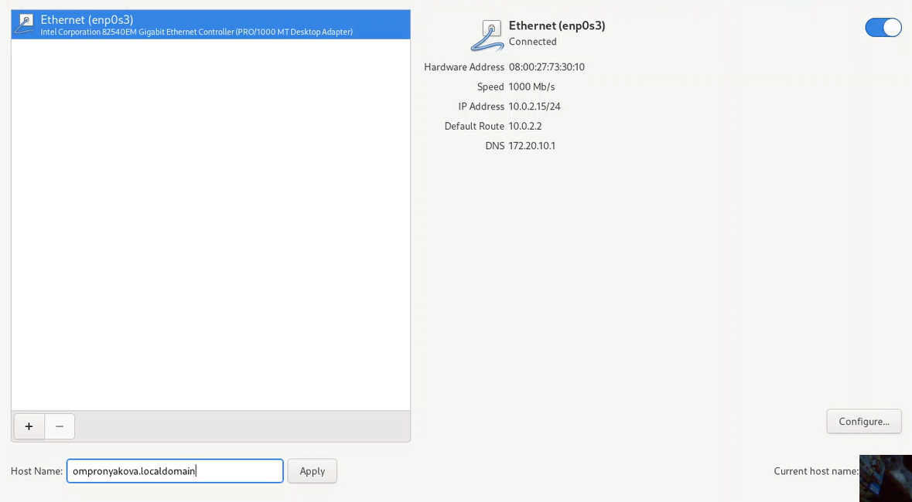{ #fig:pic5 width=100% }

## Этапы выполнения работы

Установливаем пароль для root и пользователя с правами администратора(рис.6).

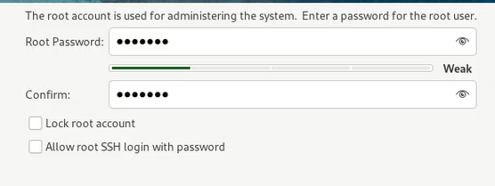{ #fig:pic6 width=100% }

## Этапы выполнения работы

После завершения установки операционной системы корректно перезапускаем виртуальную машину и при запросе принимаем условия лицензии.

Входим в ОС под заданной мною при установке учётной записью. В меню Устройства виртуальной машины подключаем образ диска дополнений гостевой ОС, при необходимости вводим пароль пользователя root нашей виртуальной ОС. После загрузки дополнений нажимаем Return или Enter и корректно перезагружаем виртуальную машину(рис.7).

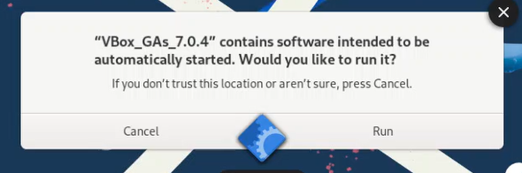{ #fig:pic7 width=100% }

## Этапы выполнения работы

проверяем, что мы задали имя пользователя или имя хоста, удовлетворяющее соглашению об именовании(рис.8).

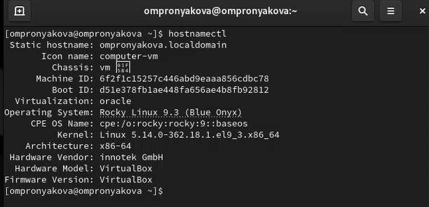{ #fig:pic8 width=100% }

## Этапы выполнения работы

В окне терминала проанализируем последовательность загрузки системы, выполнив команду dmesg(рис.9).

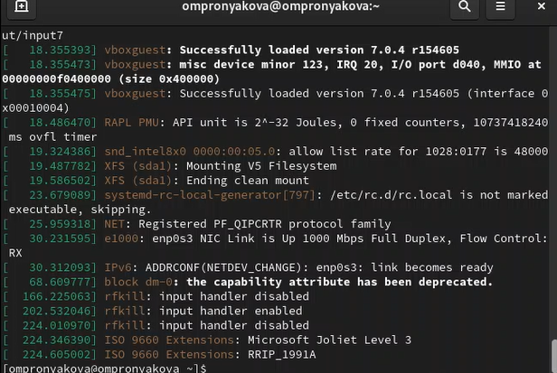{ #fig:pic9 width=100% }

## Этапы выполнения работы

Получаем информацию о Версии ядра Linux (Linux version). Частота процессора (Detected Mhz processor). Модель процессора (CPU0)(рис.10).

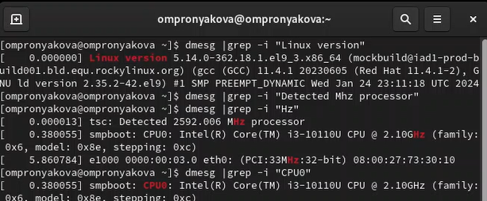{ #fig:pic10 width=100% }

## Этапы выполнения работы

Получаем информацию об Объеме доступной оперативной памяти (Memory available)(рис.11).

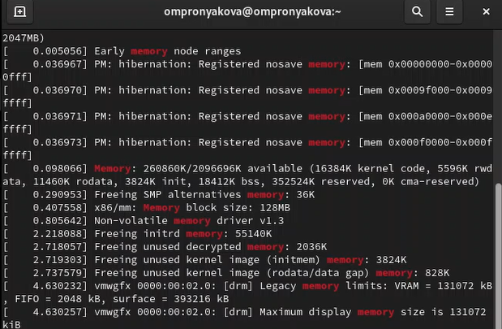{ #fig:pic11 width=100% }

## Этапы выполнения работы

Получаем информацию о типе обнаруженного гипервизора (Hypervisor detected)(рис.12).

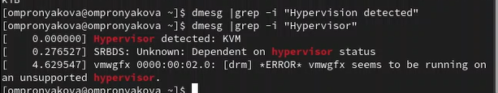{ #fig:pic12 width=100% }

## Этапы выполнения работы

Получаем информацию о типе файловой системы корневого раздела(рис.13), (рис.14).

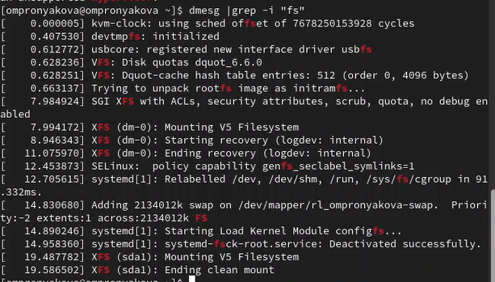{ #fig:pic13 width=100% }

## Этапы выполнения работы

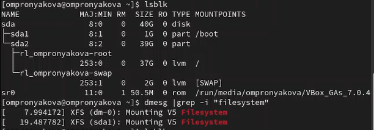{ #fig:pic14 width=100% }

## Этапы выполнения работы

Получаем информацию о последовательности монтирования файловых систем(рис.15).

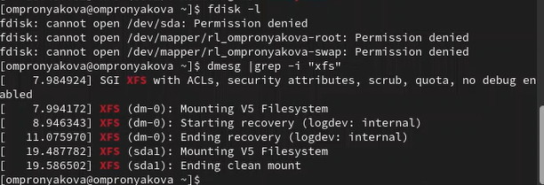{ #fig:pic15 width=100% }

## Выводы

- Я приобрела практические навыки установки операционной системы на виртуальную машину, настройки минимально необходимых для дальнейшей работы сервисов.

