---
## Front matter
title: "Лабораторная работа №1"
subtitle: "Дисциплина: основы информационной безопасности"
author: "Пронякова Ольга Максимовна"

## Generic otions
lang: ru-RU
toc-title: "Содержание"

## Bibliography
bibliography: bib/cite.bib
csl: pandoc/csl/gost-r-7-0-5-2008-numeric.csl

## Pdf output format
toc: true # Table of contents
toc-depth: 2
lof: true # List of figures
lot: true # List of tables
fontsize: 12pt
linestretch: 1.5
papersize: a4
documentclass: scrreprt
## I18n polyglossia
polyglossia-lang:
  name: russian
  options:
	- spelling=modern
	- babelshorthands=true
polyglossia-otherlangs:
  name: english
## I18n babel
babel-lang: russian
babel-otherlangs: english
## Fonts
mainfont: PT Serif
romanfont: PT Serif
sansfont: PT Sans
monofont: PT Mono
mainfontoptions: Ligatures=TeX
romanfontoptions: Ligatures=TeX
sansfontoptions: Ligatures=TeX,Scale=MatchLowercase
monofontoptions: Scale=MatchLowercase,Scale=0.9
## Biblatex
biblatex: true
biblio-style: "gost-numeric"
biblatexoptions:
  - parentracker=true
  - backend=biber
  - hyperref=auto
  - language=auto
  - autolang=other*
  - citestyle=gost-numeric
## Pandoc-crossref LaTeX customization
figureTitle: "Рис."
tableTitle: "Таблица"
listingTitle: "Листинг"
lofTitle: "Список иллюстраций"
lotTitle: "Список таблиц"
lolTitle: "Листинги"
## Misc options
indent: true
header-includes:
  - \usepackage{indentfirst}
  - \usepackage{float} # keep figures where there are in the text
  - \floatplacement{figure}{H} # keep figures where there are in the text
---

# Цель работы

Целью данной работы является приобретение практических навыков установки операционной системы на виртуальную машину, настройки минимально необходимых для дальнейшей работы сервисов.

# Задание

1. Установить дистрибутив Rocky
2. Проанализировать последовательность загрузки системы
3. Получите следующую информацию:
	1) Версия ядра Linux (Linux version).
	2) Частота процессора (Detected Mhz processor).
	3) Модель процессора (CPU0).
	4) Объем доступной оперативной памяти (Memory available).
	5) Тип обнаруженного гипервизора (Hypervisor detected).
	6) Тип файловой системы корневого раздела.
	7) Последовательность монтирования файловых систем.

# Теоретическое введение

Лабораторная работа подразумевает установку на виртуальную машину
VirtualBox (https://www.virtualbox.org/) операционной системы Linux
(дистрибутив Rocky (https://rockylinux.org/)).
Выполнение работы возможно как в дисплейном классе факультета
физико-математических и естественных наук РУДН, так и дома. Описание
выполнения работы приведено для дисплейного класса со следующими ха-
рактеристиками:
– Intel Core i3-550 3.2 GHz, 4 GB оперативной памяти, 20 GB свободного
места на жёстком диске;
– ОС Linux Gentoo (http://www.gentoo.ru/);
– VirtualBox верс. 6.1 или старше;
– каталог с образами ОС для работающих в дисплейном классе:
/afs/dk.sci.pfu.edu.ru/common/files/iso/.

# Выполнение лабораторной работы

Создаем новую виртуальную машину. Для этого в VirtualBox выбераем Машина -> Создать. Указываем имя виртуальной машины (мой логин в дисплейном классе), тип
операционной системы — Linux, RedHat (64-bit)(рис.[-@fig:pic1]).

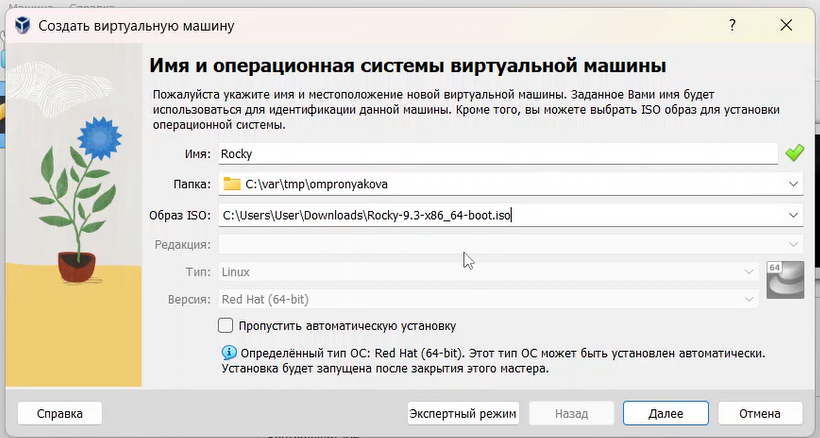{ #fig:pic1 width=100% }

Указываем размер основной памяти виртуальной машины — 2048МБ. Задаем конфигурацию жёсткого диска — загрузочный, VDI (BirtualBox Disk Image), динамический виртуальный диск. Задаем размер диска — 40 ГБ. Выбераем в VirtualBox для нашей виртуальной машины Настройки -> Носители Добавьте новый привод оптических дисков и выберите образ
операционной системы(рис.[-@fig:pic2]).

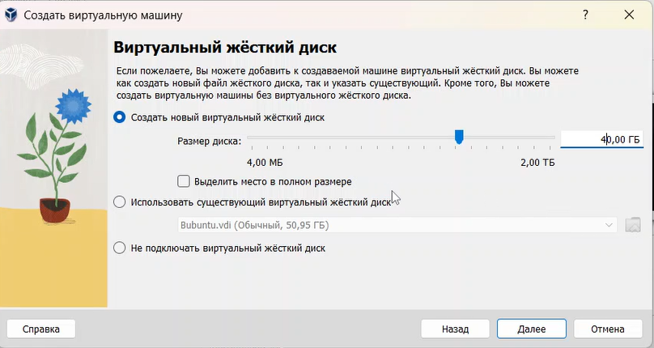{ #fig:pic2 width=100% }

Запускаем виртуальную машину и выбераем English в качестве языка интерфейса. Переходим к настройкам установки операционной системы(рис.[-@fig:pic3]).

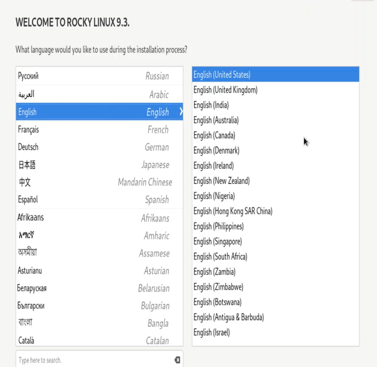{ #fig:pic3 width=100% }

В разделе выбора программ указываем в качестве базового окружения Server with GUI, а в качестве дополнения — Development Tools. Отключаем KDUMP. Место установки ОС оставляем без изменения(рис.[-@fig:pic4]).

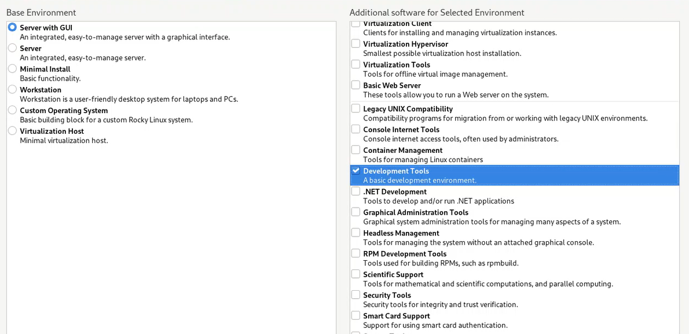{ #fig:pic4 width=100% }

Включаем сетевое соединение и в качестве имени узла указываем user.localdomain, где вместо user указываем имя своего пользователя в соответствии с соглашением об именовании(рис.[-@fig:pic5]).

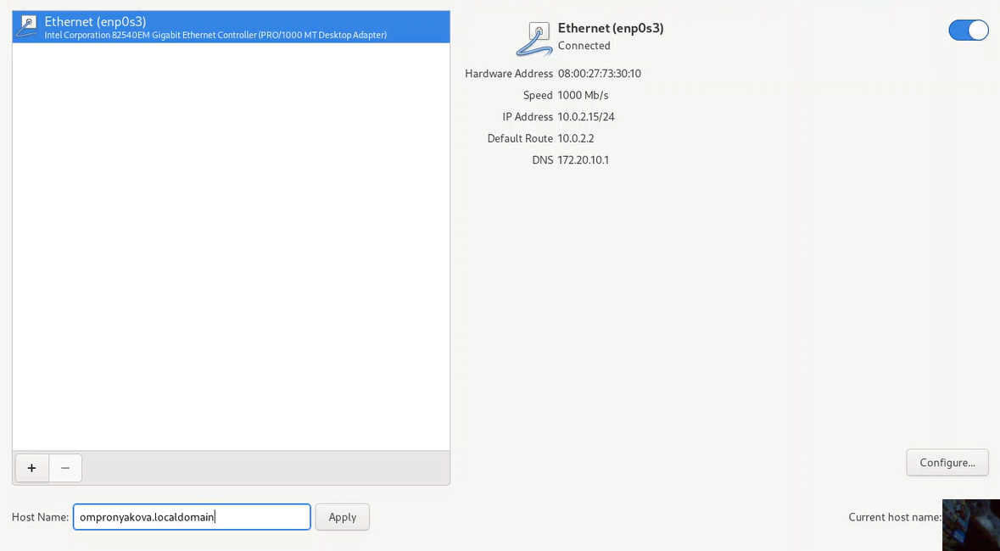{ #fig:pic5 width=100% }

Установливаем пароль для root и пользователя с правами администратора(рис.[-@fig:pic6]).

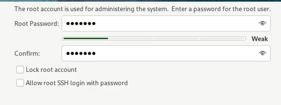{ #fig:pic6 width=100% }

После завершения установки операционной системы корректно перезапускаем виртуальную машину и при запросе принимаем условия лицензии.

Входим в ОС под заданной мною при установке учётной записью. В меню Устройства виртуальной машины подключаем образ диска дополнений гостевой ОС, при необходимости вводим пароль пользователя root нашей виртуальной ОС. После загрузки дополнений нажимаем Return или Enter и корректно перезагружаем виртуальную машину(рис.[-@fig:pic7]).

{ #fig:pic7 width=100% }

проверяем, что мы задали имя пользователя или имя хоста, удовлетворяющее соглашению об именовании(рис.[-@fig:pic8]).

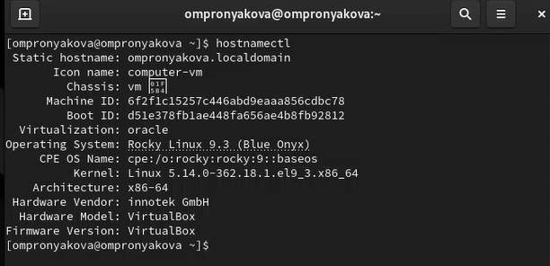{ #fig:pic8 width=100% }

В окне терминала проанализируем последовательность загрузки системы, выполнив команду dmesg(рис.[-@fig:pic9]).

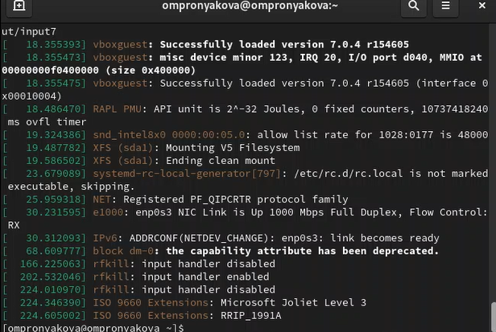{ #fig:pic9 width=100% }

Получаем информацию о Версии ядра Linux (Linux version). Частота процессора (Detected Mhz processor). Модель процессора (CPU0)(рис.[-@fig:pic10]).

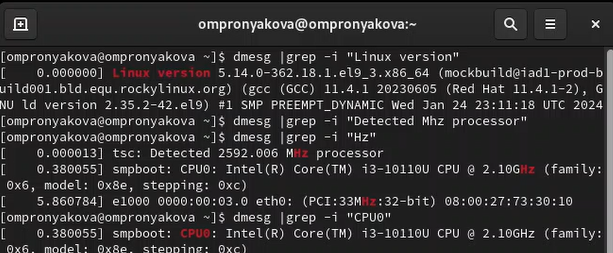{ #fig:pic10 width=100% }

Получаем информацию об Объеме доступной оперативной памяти (Memory available)(рис.[-@fig:pic11]).

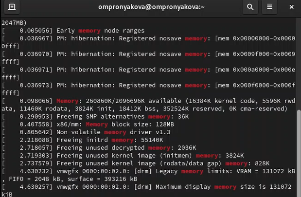{ #fig:pic11 width=100% }

Получаем информацию о типе обнаруженного гипервизора (Hypervisor detected)(рис.[-@fig:pic12]).

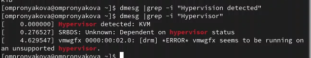{ #fig:pic12 width=100% }

Получаем информацию о типе файловой системы корневого раздела(рис.[-@fig:pic13]), (рис.[-@fig:pic14]).

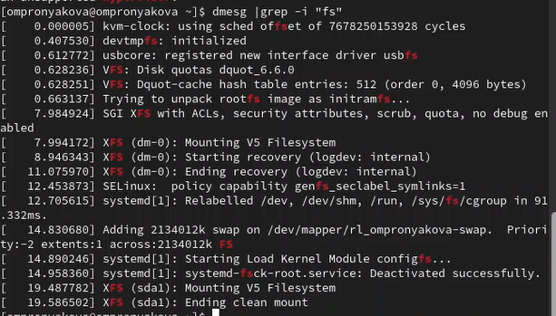{ #fig:pic13 width=100% }

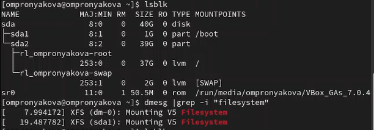{ #fig:pic14 width=100% }

Получаем информацию о последовательности монтирования файловых систем(рис.[-@fig:pic15]).

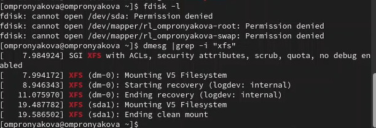{ #fig:pic15 width=100% }

# Выводы

Я приобрела практические навыки установки операционной системы на виртуальную машину, настройки минимально необходимых для дальнейшей работы сервисов.

# Список литературы{.unnumbered}

[1. Установка и конфигурация операционной системы на виртуальную машину](https://esystem.rudn.ru/pluginfile.php/2293709/mod_folder/content/0/001-lab_virtualbox.pdf)

::: {#refs}
:::
