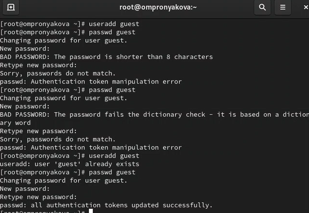
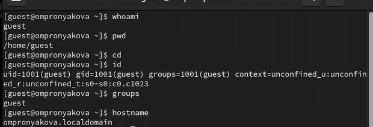
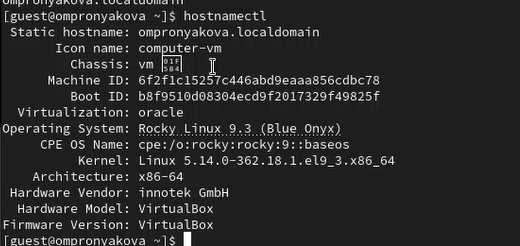
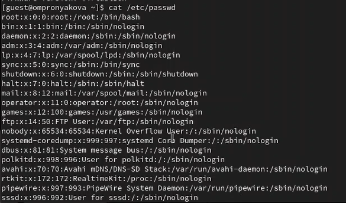
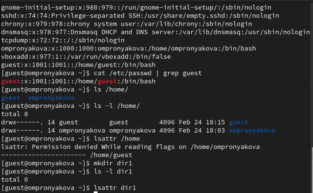
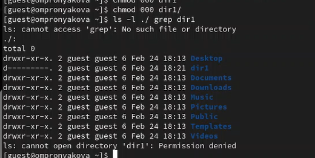
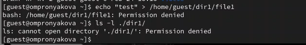
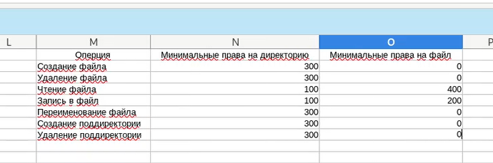

---
## Front matter
lang: ru-RU
title: Лабораторная работа №2
subtitle: Дисциплина - основы информационной безопасности
author:
  - Пронякова О.М.
institute:
  - Российский университет дружбы народов, Москва, Россия
date: 24 февраля 2024

## i18n babel
babel-lang: russian
babel-otherlangs: english

## Formatting pdf
toc: false
toc-title: Содержание
slide_level: 2
aspectratio: 169
section-titles: true
theme: metropolis
header-includes:
 - \metroset{progressbar=frametitle,sectionpage=progressbar,numbering=fraction}
 - '\makeatletter'
 - '\beamer@ignorenonframefalse'
 - '\makeatother'
---

# Информация

## Докладчик

:::::::::::::: {.columns align=center}
::: {.column width="70%"}

  * Пронякова Ольга Максимовна
  * студент НКАбд-02-22
  * факультет физико-математических и естественных наук
  * Российский университет дружбы народов

:::
::::::::::::::

# Создание презентации

## Цель работы

Получить практические навыки работы в консоли с атрибутами файлов, закрепить теоретические основы дискреционного разграничения доступа в современных системах с открытым кодом на базе ОС Linux1.

## Этапы выполнения работы

В установленной при выполнении предыдущей лабораторной работы операционной системе создаю учётную запись пользователя guest: useradd guest. Далее задаю пароль для пользователя guest:
passwd guest(рис.1).

{ #fig:pic1 width=100% }

## Этапы выполнения работы

Вхожу в систему от имени пользователя guest. Определяю директорию, в которой нахожусь, командой pwd. Определяю, является ли она домашней директорией? Уточняю имя моего пользователя командой whoami и его группу, а также группы, куда входит пользователь, командой id(рис.2), (рис.3).

{ #fig:pic2 width=100% }

## Этапы выполнения работы

{ #fig:pic3 width=100% }

## Этапы выполнения работы

Просмотриваю файл /etc/passwd командой cat /etc/passwd. Нахожу в нём свою учётную запись. Опредяю uid пользователя. Опредяю gid пользователя(рис.4).

{ #fig:pic4 width=100% }

## Этапы выполнения работы

Определяю существующие в системе директории командой ls -l /home/ Проверяю какие расширенные атрибуты установлены на поддиректориях, находящихся в директории /home, командой: lsattr /home
Создаю в домашней директории поддиректорию dir1 командой mkdir dir1
Определяю командами ls -l и lsattr, какие права доступа и расширенные атрибуты были выставлены на директорию dir1(рис.5).

{ #fig:pic5 width=100% }

## Этапы выполнения работы

Снимаю с директории dir1 все атрибуты командой chmod 000 dir1 и проверяю с её помощью правильность выполнения команды ls -l(рис.6).

{ #fig:pic6 width=100% }

## Этапы выполнения работы

Создаю в директории dir1 файл file1 командой echo "test" > /home/guest/dir1/file1
Проверяю командой ls -l /home/guest/dir1(рис.7).

{ #fig:pic7 width=100% }

## Этапы выполнения работы

Заполняю таблицу «Установленные права и разрешённые действия», выполняя действия от имени владельца директории (файлов), определив опытным путём, какие операции разрешены, а какие нет.
Если операция разрешена, заношу в таблицу знак «+», если не разрешена, знак «-». На основании заполненной таблицы определяю те или иные минимально необходимые права для выполнения операций внутри директории dir1, заполняю таблицу(рис.8), (рис.9).

## Этапы выполнения работы

{ #fig:pic8 width=100% }

## Этапы выполнения работы

{ #fig:pic9 width=100% }

## Выводы

Получила практические навыки работы в консоли с атрибутами файлов, закрепила теоретические основы дискреционного разграничения доступа в современных системах с открытым кодом на базе ОС Linux1.

