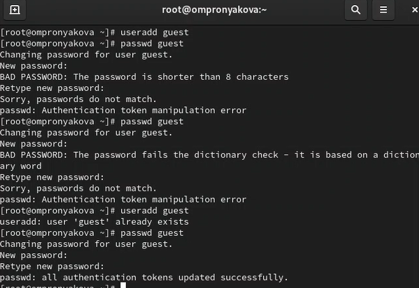
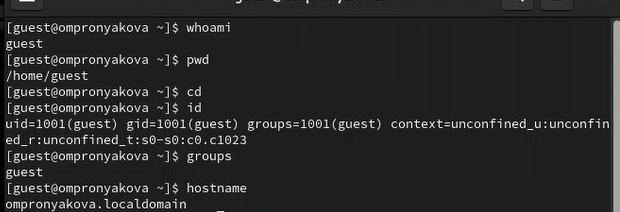
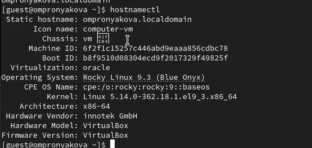
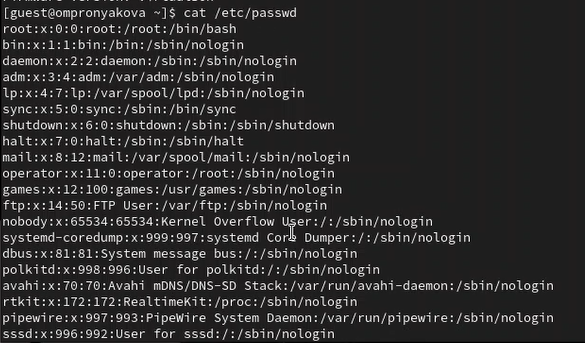
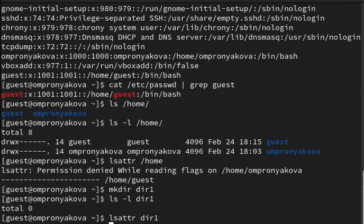
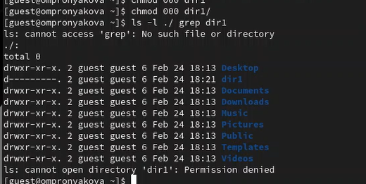
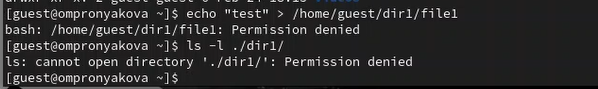
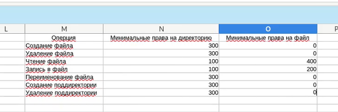

---
## Front matter
title: "Лабораторная работа №2"
subtitle: "Дисциплина: основы информационной безопасности"
author: "Пронякова Ольга Максимовна"

## Generic otions
lang: ru-RU
toc-title: "Содержание"

## Bibliography
bibliography: bib/cite.bib
csl: pandoc/csl/gost-r-7-0-5-2008-numeric.csl

## Pdf output format
toc: true # Table of contents
toc-depth: 2
lof: true # List of figures
lot: true # List of tables
fontsize: 12pt
linestretch: 1.5
papersize: a4
documentclass: scrreprt
## I18n polyglossia
polyglossia-lang:
  name: russian
  options:
	- spelling=modern
	- babelshorthands=true
polyglossia-otherlangs:
  name: english
## I18n babel
babel-lang: russian
babel-otherlangs: english
## Fonts
mainfont: PT Serif
romanfont: PT Serif
sansfont: PT Sans
monofont: PT Mono
mainfontoptions: Ligatures=TeX
romanfontoptions: Ligatures=TeX
sansfontoptions: Ligatures=TeX,Scale=MatchLowercase
monofontoptions: Scale=MatchLowercase,Scale=0.9
## Biblatex
biblatex: true
biblio-style: "gost-numeric"
biblatexoptions:
  - parentracker=true
  - backend=biber
  - hyperref=auto
  - language=auto
  - autolang=other*
  - citestyle=gost-numeric
## Pandoc-crossref LaTeX customization
figureTitle: "Рис."
tableTitle: "Таблица"
listingTitle: "Листинг"
lofTitle: "Список иллюстраций"
lotTitle: "Список таблиц"
lolTitle: "Листинги"
## Misc options
indent: true
header-includes:
  - \usepackage{indentfirst}
  - \usepackage{float} # keep figures where there are in the text
  - \floatplacement{figure}{H} # keep figures where there are in the text
---

# Цель работы

Получить практические навыки работы в консоли с атрибутами файлов, закрепить теоретические основы дискреционного разграничения доступа в современных системах с открытым кодом на базе ОС Linux1.

# Выполнение лабораторной работы

В установленной при выполнении предыдущей лабораторной работы операционной системе создаю учётную запись пользователя guest: useradd guest. Далее задаю пароль для пользователя guest:
passwd guest(рис.[-@fig:pic1]).

{ #fig:pic1 width=100% }

Вхожу в систему от имени пользователя guest. Определяю директорию, в которой нахожусь, командой pwd. Определяю, является ли она домашней директорией? Уточняю имя моего пользователя командой whoami и его группу, а также группы, куда входит пользователь, командой id(рис.[-@fig:pic2]), (рис.[-@fig:pic3]).

{ #fig:pic2 width=100% }

{ #fig:pic3 width=100% }

Просмотриваю файл /etc/passwd командой cat /etc/passwd. Нахожу в нём свою учётную запись. Опредяю uid пользователя. Опредяю gid пользователя(рис.[-@fig:pic4]).

{ #fig:pic4 width=100% }

Определяю существующие в системе директории командой ls -l /home/ Проверяю какие расширенные атрибуты установлены на поддиректориях, находящихся в директории /home, командой: lsattr /home
Создаю в домашней директории поддиректорию dir1 командой mkdir dir1
Определяю командами ls -l и lsattr, какие права доступа и расширенные атрибуты были выставлены на директорию dir1(рис.[-@fig:pic5]).

{ #fig:pic5 width=100% }

Снимаю с директории dir1 все атрибуты командой chmod 000 dir1 и проверяю с её помощью правильность выполнения команды ls -l(рис.[-@fig:pic6]).

{ #fig:pic6 width=100% }

Создаю в директории dir1 файл file1 командой echo "test" > /home/guest/dir1/file1
Проверяю командой ls -l /home/guest/dir1(рис.[-@fig:pic7]).

{ #fig:pic7 width=100% }

Заполняю таблицу «Установленные права и разрешённые действия», выполняя действия от имени владельца директории (файлов), определив опытным путём, какие операции разрешены, а какие нет.
Если операция разрешена, заношу в таблицу знак «+», если не разрешена, знак «-». На основании заполненной таблицы определяю те или иные минимально необходимые права для выполнения операций внутри директории dir1, заполняю таблицу(рис.[-@fig:pic8]), (рис.[-@fig:pic9]).

{ #fig:pic8 width=100% }

{ #fig:pic9 width=100% }

# Выводы

Получила практические навыки работы в консоли с атрибутами файлов, закрепила теоретические основы дискреционного разграничения доступа в современных системах с открытым кодом на базе ОС Linux1.

# Список литературы{.unnumbered}

[1. Дискреционное разграничение прав в Linux. Основные атрибуты](https://esystem.rudn.ru/pluginfile.php/2293712/mod_resource/content/6/002-lab_discret_attr.pdf)

::: {#refs}
:::
