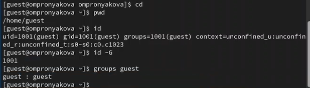

---
## Front matter
lang: ru-RU
title: Лабораторная работа №3
subtitle: Дисциплина - основы информационной безопасности
author:
  - Пронякова О.М.
institute:
  - Российский университет дружбы народов, Москва, Россия
date: 10 марта 2024

## i18n babel
babel-lang: russian
babel-otherlangs: english

## Formatting pdf
toc: false
toc-title: Содержание
slide_level: 2
aspectratio: 169
section-titles: true
theme: metropolis
header-includes:
 - \metroset{progressbar=frametitle,sectionpage=progressbar,numbering=fraction}
 - '\makeatletter'
 - '\beamer@ignorenonframefalse'
 - '\makeatother'
---

# Информация

## Докладчик

:::::::::::::: {.columns align=center}
::: {.column width="70%"}

  * Пронякова Ольга Максимовна
  * студент НКАбд-02-22
  * факультет физико-математических и естественных наук
  * Российский университет дружбы народов

:::
::::::::::::::

# Создание презентации

## Цель работы

Получить практические навыки работы в консоли с атрибутами файлов для групп пользователей.

## Этапы выполнения работы

В прошлой лабораторной работе создавала учётную запись пользователя guest(рис.1).

{ #fig:pic1 width=100% }

## Этапы выполнения работы

Аналогично создаю второго пользователя guest2(рис.2).

{ #fig:pic2 width=100% }

## Этапы выполнения работы

Добавляю пользователя guest2 в группу guest gpasswd -a guest2 guest(рис.3). 

{ #fig:pic3 width=100% }

## Этапы выполнения работы

Вхожу в систему от двух пользователей на двух разных консолях: guest на первой консоли и guest2 на второй консоли(рис.4), (рис.5).

{ #fig:pic4 width=100% }

## Этапы выполнения работы

{ #fig:pic5 width=100% }

## Этапы выполнения работы

Для обоих пользователей командой pwd определяю директорию, в которой нахожусь. Уточняю имя пользователя, его группу, кто входит в неё и к каким группам принадлежит он сам. Определяю командами groups guest и groups guest2, в какие группы входят пользователи guest и guest2. Сравниваю вывод команды groups с выводом команд id -Gn и id -G(рис.6), (рис.7).

{ #fig:pic6 width=100% }

## Этапы выполнения работы

{ #fig:pic7 width=100% }

## Этапы выполнения работы

Сравниваю полученную информацию с содержимым файла /etc/group. Просмотриваю файл командой
cat /etc/group(рис.8).

{ #fig:pic8 width=100% }

## Этапы выполнения работы

От имени пользователя guest2 выполняю регистрацию пользователя guest2 в группе guest командой
newgrp guest. Далее от имени пользователя guest изменяю права директории /home/guest,
разрешив все действия для пользователей группы:
chmod g+rwx /home/guest
От имени пользователя guest снимаю с директории /home/guest/dir1 все атрибуты командой
chmod 000 dir(рис.9).

{ #fig:pic9 width=100% }

## Этапы выполнения работы

Меняя атрибуты у директории dir1 и файла file1 от имени пользователя guest и делая проверку от пользователя guest2, заполняю табл. 3.1, определив опытным путём, какие операции разрешены, а какие нет. Если операция разрешена, заношу в таблицу знак «+», если не разрешена,
знак «-»(рис.10).

## Этапы выполнения работы

{ #fig:pic10 width=100% }

## Выводы

Получила практические навыки работы в консоли с атрибутами файлов для групп пользователей.

