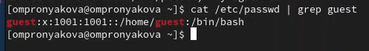
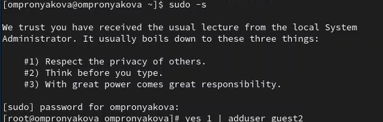
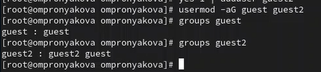
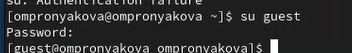
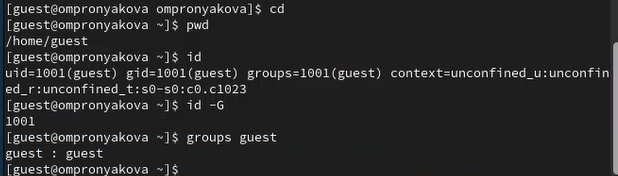
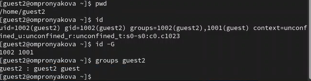
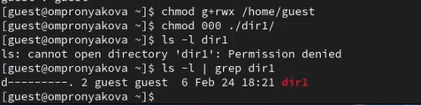
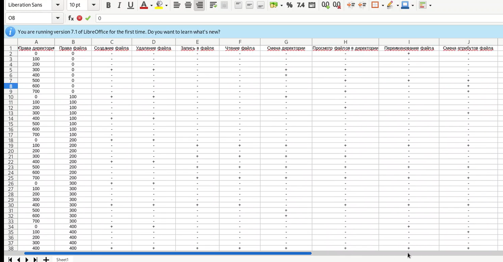

---
## Front matter
title: "Лабораторная работа №3"
subtitle: "Дисциплина: основы информационной безопасности"
author: "Пронякова Ольга Максимовна"

## Generic otions
lang: ru-RU
toc-title: "Содержание"

## Bibliography
bibliography: bib/cite.bib
csl: pandoc/csl/gost-r-7-0-5-2008-numeric.csl

## Pdf output format
toc: true # Table of contents
toc-depth: 2
lof: true # List of figures
lot: true # List of tables
fontsize: 12pt
linestretch: 1.5
papersize: a4
documentclass: scrreprt
## I18n polyglossia
polyglossia-lang:
  name: russian
  options:
	- spelling=modern
	- babelshorthands=true
polyglossia-otherlangs:
  name: english
## I18n babel
babel-lang: russian
babel-otherlangs: english
## Fonts
mainfont: PT Serif
romanfont: PT Serif
sansfont: PT Sans
monofont: PT Mono
mainfontoptions: Ligatures=TeX
romanfontoptions: Ligatures=TeX
sansfontoptions: Ligatures=TeX,Scale=MatchLowercase
monofontoptions: Scale=MatchLowercase,Scale=0.9
## Biblatex
biblatex: true
biblio-style: "gost-numeric"
biblatexoptions:
  - parentracker=true
  - backend=biber
  - hyperref=auto
  - language=auto
  - autolang=other*
  - citestyle=gost-numeric
## Pandoc-crossref LaTeX customization
figureTitle: "Рис."
tableTitle: "Таблица"
listingTitle: "Листинг"
lofTitle: "Список иллюстраций"
lotTitle: "Список таблиц"
lolTitle: "Листинги"
## Misc options
indent: true
header-includes:
  - \usepackage{indentfirst}
  - \usepackage{float} # keep figures where there are in the text
  - \floatplacement{figure}{H} # keep figures where there are in the text
---

# Цель работы

Получить практические навыки работы в консоли с атрибутами файлов для групп пользователей.

# Выполнение лабораторной работы

В прошлой лабораторной работе создавала учётную запись пользователя guest(рис.[-@fig:pic1]).

{ #fig:pic1 width=100% }

Аналогично создаю второго пользователя guest2(рис.[-@fig:pic2]).

{ #fig:pic2 width=100% }

Добавляю пользователя guest2 в группу guest gpasswd -a guest2 guest(рис.[-@fig:pic3]). 

{ #fig:pic3 width=100% }

Вхожу в систему от двух пользователей на двух разных консолях: guest на первой консоли и guest2 на второй консоли(рис.[-@fig:pic4]), (рис.[-@fig:pic5]).

{ #fig:pic4 width=100% }

{ #fig:pic5 width=100% }

Для обоих пользователей командой pwd определяю директорию, в которой нахожусь. Уточняю имя пользователя, его группу, кто входит в неё и к каким группам принадлежит он сам. Определяю командами groups guest и groups guest2, в какие группы входят пользователи guest и guest2. Сравниваю вывод команды groups с выводом команд id -Gn и id -G(рис.[-@fig:pic6]), (рис.[-@fig:pic7]).

{ #fig:pic6 width=100% }

{ #fig:pic7 width=100% }

Сравниваю полученную информацию с содержимым файла /etc/group. Просмотриваю файл командой
cat /etc/group(рис.[-@fig:pic8]).

{ #fig:pic8 width=100% }

От имени пользователя guest2 выполняю регистрацию пользователя guest2 в группе guest командой
newgrp guest. Далее от имени пользователя guest изменяю права директории /home/guest,
разрешив все действия для пользователей группы:
chmod g+rwx /home/guest
От имени пользователя guest снимаю с директории /home/guest/dir1 все атрибуты командой
chmod 000 dir(рис.[-@fig:pic9]).

{ #fig:pic9 width=100% }

Меняя атрибуты у директории dir1 и файла file1 от имени пользователя guest и делая проверку от пользователя guest2, заполняю табл. 3.1, определив опытным путём, какие операции разрешены, а какие нет. Если операция разрешена, заношу в таблицу знак «+», если не разрешена,
знак «-»(рис.[-@fig:pic10]).

{ #fig:pic10 width=100% }

# Выводы

Получила практические навыки работы в консоли с атрибутами файлов для групп пользователей.

# Список литературы{.unnumbered}

[1. Дискреционное разграничение прав в Linux. Два пользователя](https://esystem.rudn.ru/pluginfile.php/2293714/mod_resource/content/4/003-lab_discret_2users.pdf)

::: {#refs}
:::
