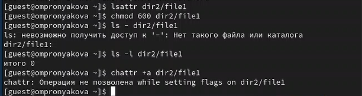
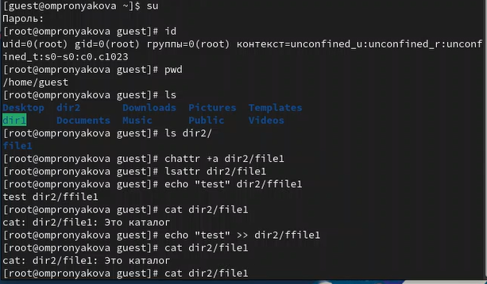

---
## Front matter
lang: ru-RU
title: Лабораторная работа №3
subtitle: Дисциплина - основы информационной безопасности
author:
  - Пронякова О.М.
institute:
  - Российский университет дружбы народов, Москва, Россия
date: 29 марта 2024

## i18n babel
babel-lang: russian
babel-otherlangs: english

## Formatting pdf
toc: false
toc-title: Содержание
slide_level: 2
aspectratio: 169
section-titles: true
theme: metropolis
header-includes:
 - \metroset{progressbar=frametitle,sectionpage=progressbar,numbering=fraction}
 - '\makeatletter'
 - '\beamer@ignorenonframefalse'
 - '\makeatother'
---

# Информация

## Докладчик

:::::::::::::: {.columns align=center}
::: {.column width="70%"}

  * Пронякова Ольга Максимовна
  * студент НКАбд-02-22
  * факультет физико-математических и естественных наук
  * Российский университет дружбы народов
:::
::: {.column width="30%"}

:::
::::::::::::::

# Создание презентации

## Цель работы

Получить практических навыков работы в консоли с расширенными атрибутами файлов1

## Этапы выполнения работы

1. От имени пользователя guest определите расширенные атрибуты файла
/home/guest/dir1/file1 командой
lsattr /home/guest/dir1/file1
2. Установите командой
chmod 600 file1
на файл file1 права, разрешающие чтение и запись для владельца фай-
ла.
3. Попробуйте установить на файл /home/guest/dir1/file1 расширен-
ный атрибут a от имени пользователя guest:
chattr +a /home/guest/dir1/file1
В ответ вы должны получить отказ от выполнения операции.
4. Зайдите на третью консоль с правами администратора либо повысьте
свои права с помощью команды su. Попробуйте установить расширен-
ный атрибут a на файл /home/guest/dir1/file1 от имени суперполь-
зователя:
chattr +a /home/guest/dir1/file1(рис.1).

## Этапы выполнения работы

{ #fig:pic1 width=100% }

## Этапы выполнения работы

5. От пользователя guest проверьте правильность установления атрибута:
lsattr /home/guest/dir1/file1
6. Выполните дозапись в файл file1 слова «test» командой
echo "test" /home/guest/dir1/file1
После этого выполните чтение файла file1 командой
cat /home/guest/dir1/file1
Убедитесь, что слово test было успешно записано в file1.
7. Попробуйте удалить файл file1 либо стереть имеющуюся в нём инфор-
мацию командой
echo "abcd" > /home/guest/dirl/file1
Попробуйте переименовать файл(рис.2).

## Этапы выполнения работы

{ #fig:pic2 width=100% }

## Выводы

Получила практические навыки работы в консоли с расширенными атрибутами файлов1

