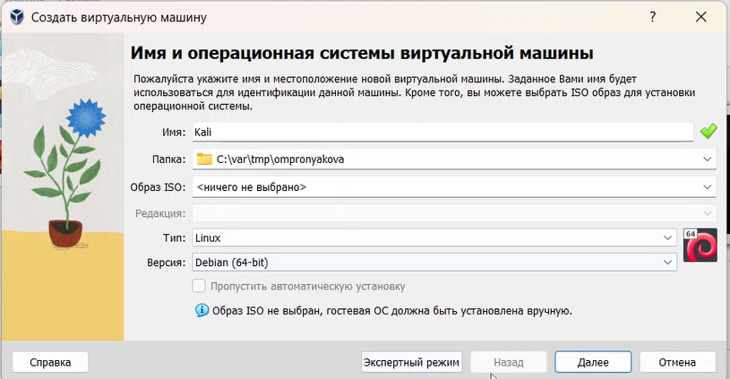
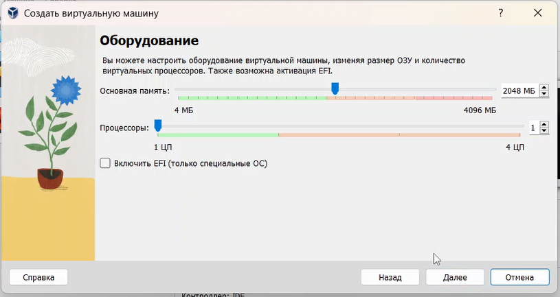
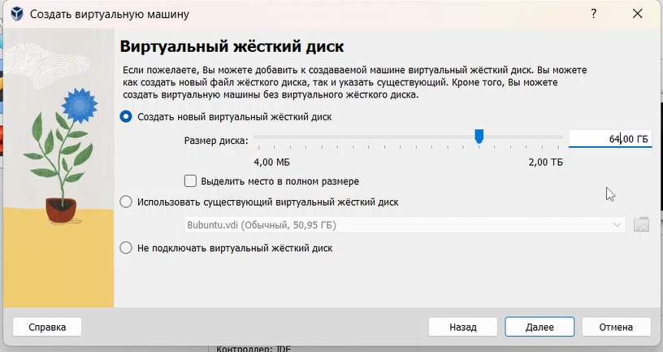
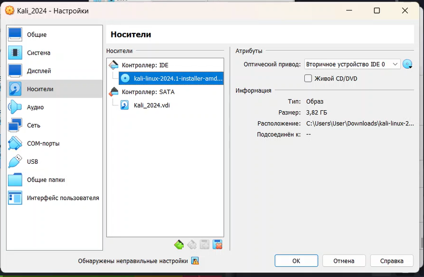
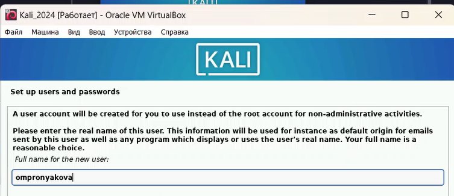
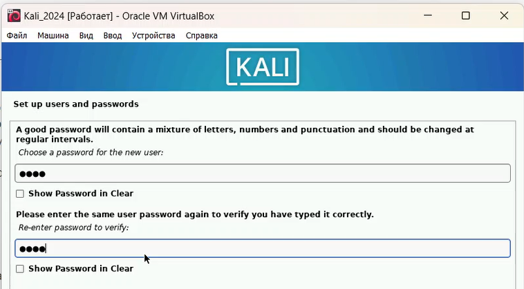
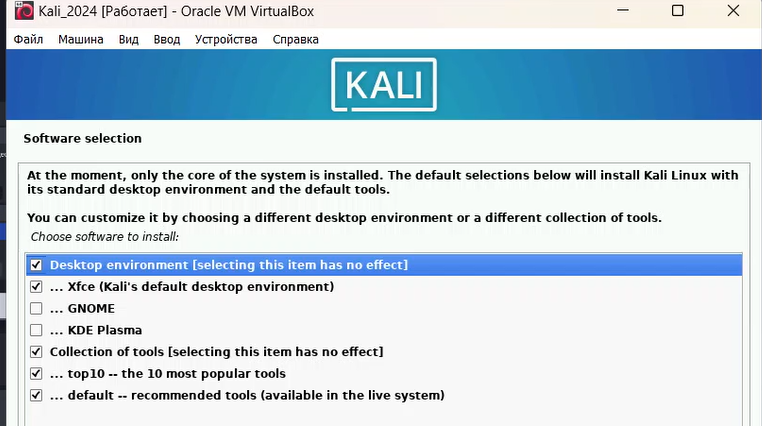
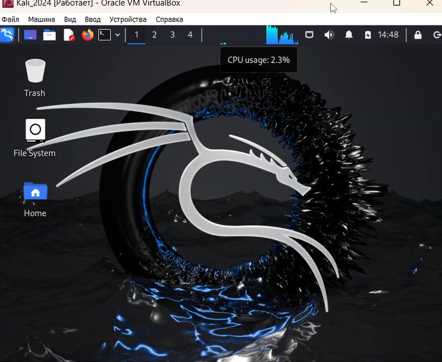

---
## Front matter
lang: ru-RU
title: Лабораторная работа №1
subtitle: Дисциплина - основы информационной безопасности
author:
  - Пронякова О.М.
institute:
  - Российский университет дружбы народов, Москва, Россия
date: 1 марта 2024

## i18n babel
babel-lang: russian
babel-otherlangs: english

## Formatting pdf
toc: false
toc-title: Содержание
slide_level: 2
aspectratio: 169
section-titles: true
theme: metropolis
header-includes:
 - \metroset{progressbar=frametitle,sectionpage=progressbar,numbering=fraction}
 - '\makeatletter'
 - '\beamer@ignorenonframefalse'
 - '\makeatother'
---

# Информация

## Докладчик

:::::::::::::: {.columns align=center}
::: {.column width="70%"}

  * Пронякова Ольга Максимовна
  * студент НКАбд-02-22
  * факультет физико-математических и естественных наук
  * Российский университет дружбы народов

:::
::::::::::::::

# Создание презентации

## Цель работы

Научиться основным способам тестирования веб приложений.

## Этапы выполнения работы

Установливаю дистрибутив Kali Linux в виртуальную машину и настраиваю ее. В качестве среды виртуализации использую VirtualBox(рис.1), (рис.2), (рис.3), (рис.4).

{ #fig:pic1 width=100% }

## Этапы выполнения работы

{ #fig:pic2 width=100% }

## Этапы выполнения работы

{ #fig:pic3 width=100% }

## Этапы выполнения работы

{ #fig:pic4 width=100% }

## Этапы выполнения работы

Выбираю язык раскладки для виртуальной машины(рис.5).

{ #fig:pic5 width=100% }

## Этапы выполнения работы

Ввожу логин и пароль(рис.6), (рис.7).

{ #fig:pic6 width=100% }

## Этапы выполнения работы

{ #fig:pic7 width=100% }

## Этапы выполнения работы

Конечная установка машины(рис.8), (рис.9).

{ #fig:pic8 width=100% }

## Этапы выполнения работы

{ #fig:pic9 width=100% }

## Выводы

Успешно установила дистрибутив Kali Linux в виртуальную машину.

